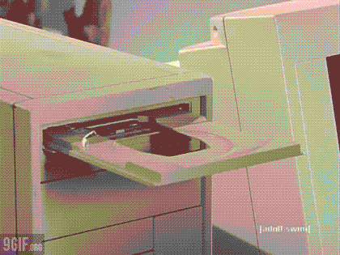

        

        

        <H2>Chapter 1</H2>
        <h1>Welcome to Netbeanz</h1>
        <ul class="sequenced-list">
                
                <li>
                        

                                <a href="{{ chapter.url }}" class="bouncing-link">{{ chapter.data.title }}</a>
                        

                       
{{ chapter.data.crate }}

                        
                       </li> 
              
        </ul>
       

